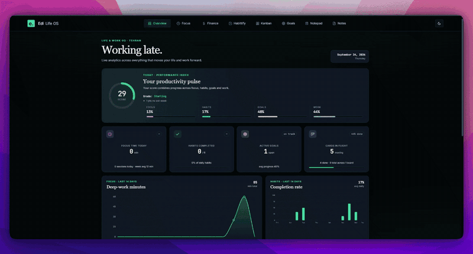

# Edi Life OS

A private dashboard for focus, finance, habits, kanban, goals, and Markdown notes. Requires PHP 8.1+, PDO MySQL, and MySQL 8+. App data is stored in MySQL. Existing browser data is imported once; conflicting older copies are archived in the `app_state` table as `legacy_backup_*` rows.

## Setup

1. Edit `config.php` with your MySQL host, database name, database account, and app login. The committed values are fake test placeholders; **never commit real credentials**.
2. Ensure the MySQL account can create the database and tables (or have an administrator grant those privileges).
3. From the repository root, run `php -S localhost:8000 -t public_html server.php` and open <http://localhost:8000>. The first login creates the database and all tables automatically.

For Apache, use `public_html` as the document root and enable `.htaccess` rewrites. Use HTTPS outside localhost.

To preserve an existing Habittify SQLite database, run `php migrate-sqlite.php /absolute/path/to/habits.db` **before opening the app** with the new MySQL database. This requires empty habit tables and leaves the SQLite file untouched.

Run `node --test tests/timer.test.mjs` for timer checks.
